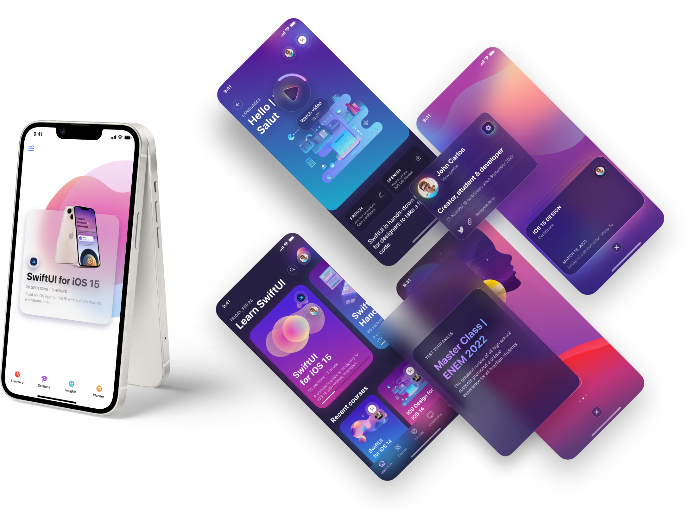

# SwiftUI App for iOS 15

Learn how I built a SwiftUI 3 app with custom layouts, animations and gestures using Xcode 13, SF Symbols 3, Canvas, Concurrency, Searchable and a whole lot more.

---

**NOTE:**
The app is not finished yet.

---

