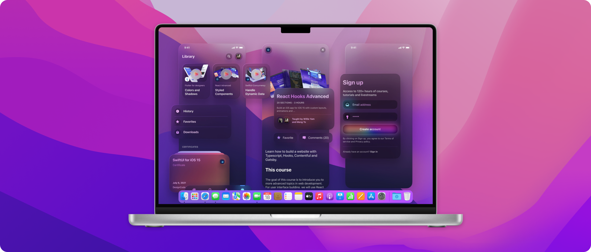
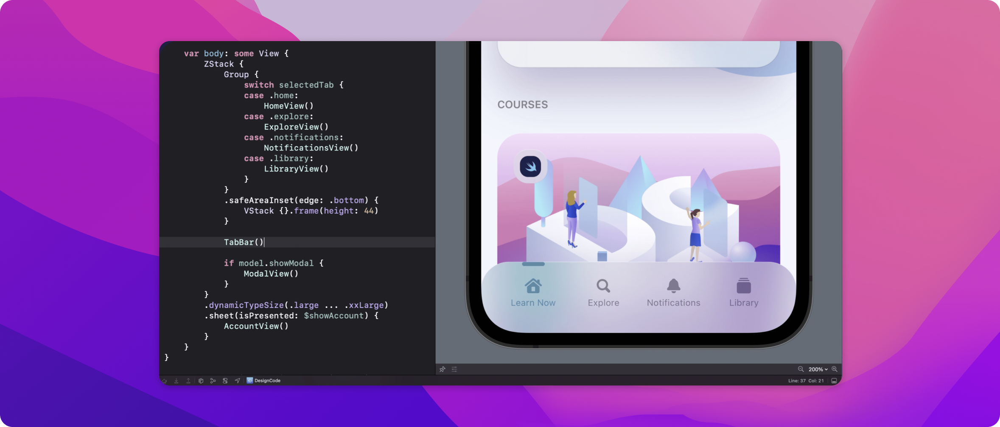
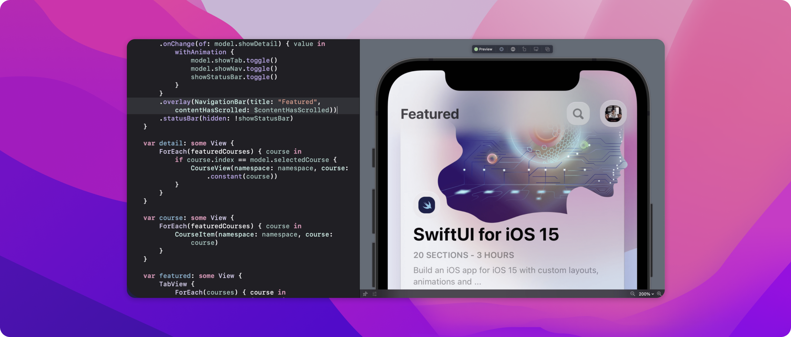

Learn how I built a SwiftUI 3 app with custom layouts, animations and gestures using Xcode 13, SF Symbols 3, Canvas, Concurrency, Searchable and a whole lot more.

## What you'll build

We'll build an iOS 15 app from scratch focusing on custom layout techniques, animations and interactions. We'll build our own custom Tab Bar, Navigation Bar and interactions. While SwiftUI hasn't changed significantly over the past 3 years, the framework is far more comprehensive, with more concise code for state management, animation and now fully supporting effects like blur material.


## Requirements

This app was built with **Xcode 13**, **iOS 15** and **MacOS Monterey**. It's important that you meet these requirements, as some newly introduced features are only available after iOS 15 and in Xcode 13.



## Custom Modifiers

When you repeat the same modifiers or collection of styles over and over, it is a good idea to start your custom modifiers. A huge advantage with this technique is that you can isolate the styles, just like a component, and apply conditions based on resolutions and devices. Also, when you apply changes, it'll apply everywhere at once.

```swift
struct BackgroundStyle: ViewModifier {
    var cornerRadius: CGFloat = 20
    var opacity: Double = 0.6
    @AppStorage("isLiteMode") var isLiteMode = true

    func body(content: Content) -> some View {
        content
            .backgroundColor(opacity: opacity)
            .cornerRadius(cornerRadius)
            .shadow(color: Color("Shadow").opacity(isLiteMode ? 0 : 0.3), radius: 20, x: 0, y: 10)
    }
}
```

## Searchable

It's never been easier to create a search experience with text field focus and suggestions. In this course, we'll learn to customize the looks while building a search experience with data and search completion.

```swift
searchable(text: $text) {
    ForEach(suggestions) { suggestion in
        Button {
            text = suggestion.text
        } label: {
            Text(suggestion.text)
        }
        .searchCompletion(suggestion.text)
    }
}
```

## Custom Tab Bar

One of the things I wanted to teach in this course is how to create a fully custom user interface and all the challenges that come with creating a custom tab bar and navigation bar. Understanding this can not only help with building an app that stand out but also a great way to prototyping techniques on a real platform that developers use.



## Custom Navigation Bar

When you have a custom tab bar, it makes sense to pair it with a custom navigation bar. While it is recommended to use the built-in Navigation View and Tab View for best adaptability across platforms and accessibility, learning how to build and style your own will take your skills to the next level. Popular apps like Instagram, TikTok, Clubhouse actually build their very own bars. For designers, this is fantastic for prototyping since you will have less contraints and are not forced to use the stock user interface for everything.



## Concurrency

Working with functions that need to wait for tasks to complete such as an API call is now much easier with async / await. Before, you had to use completion handlers which can make the code difficult to read and debug. With concurrency, your code will be shorter, safer and you will have access to the new AsyncImage and Pull to Refresh features that leverage on the new API.

##### ASYNCIMAGE

[AsyncImage](https://developer.apple.com/documentation/swiftui/asyncimage) allows you to load an image from a URL without relying on a third-party library. It offers great features like placeholder while loading and phases for error handling. On top of that, you can easily apply transitions and animations.

Let's load an image from [Lorem Picsum](https://picsum.photos) with placeholder that shows a loading indicator.

```swift
AsyncImage(url: URL(string: "https://picsum.photos/200"), transaction: .init(animation: .easeOut)) { phase in
    switch phase {
    case .empty:
        Color.white
    case .success(let image):
        image.resizable().transition(.scale)
    case .failure(_):
        Color.gray
    @unknown default:
        Color.gray
    }
}
```

##### ASYNC / AWAIT

We can create an async function that gets data from an API without using completion handlers. Before decoding the JSON data, we have to wait for the API call to complete. Also, we're using do / catch to handle errors.

```swift
func fetchAddress() async {
    do {
        let url = URL(string: "https://random-data-api.com/api/address/random_address")!
        let (data, _) = try await URLSession.shared.data(from: url)
        address = try JSONDecoder().decode(Address.self, from: data)
    } catch {
        print("Error fetching")
    }
}
```

We can call the async function using the new task modifier.

```swift
.task {
    await fetchAddress()
}
```

##### PULL TO REFRESH

If you need to refresh the data, you can use the new refreshable modifier, which automatically creates the Pull to Refresh mechanism on a List.

```swift
.refreshable {
    await fetchAddress()
}
```
